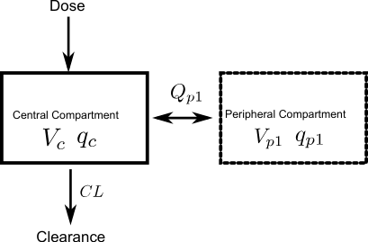
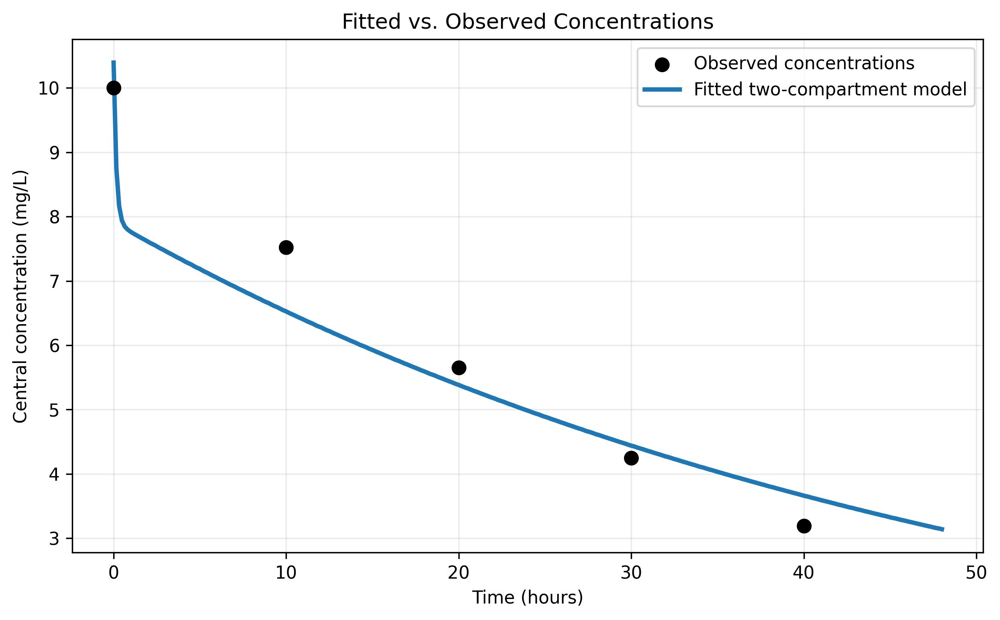
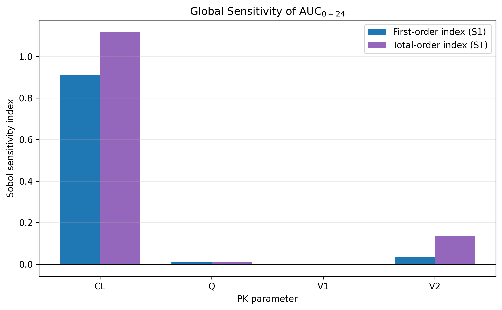
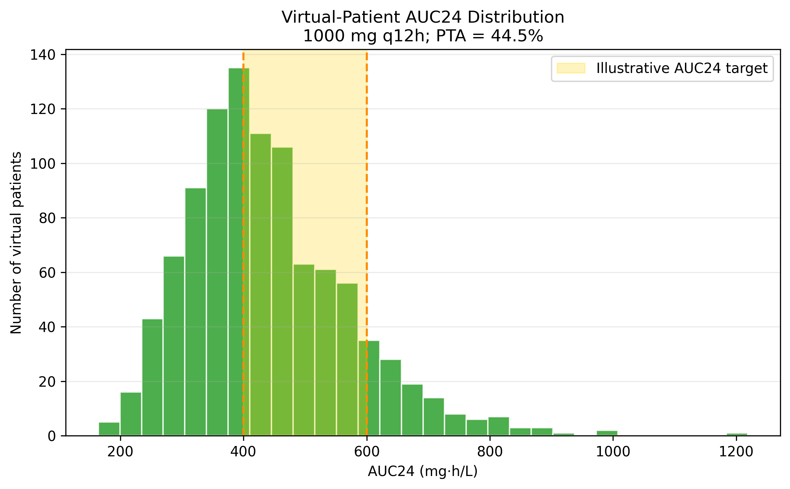

# Vancomycin PK/PD Modeling & Dosing Optimization

A computational pharmacokinetic/pharmacodynamic (PK/PD) modeling project built around a two-compartment vancomycin model. The pipeline simulates concentration-time profiles, estimates pharmacokinetic parameters from synthetic observations, evaluates model fit, computes exposure metrics, performs global sensitivity analysis, explores dosing optimization, and tests dosing regimens across a heterogeneous virtual population.

Using controlled synthetic validation data, the fitting pipeline recovered known pharmacokinetic parameters to numerical precision under sufficiently informative sampling. Population simulations also demonstrated that between-patient variability can substantially affect AUC24 target attainment even when all patients receive the same dosing regimen.

> **Clinical disclaimer**
>
> This project is intended strictly for educational, mathematical, and computational modeling purposes. It is **not** a validated clinical dosing tool and should not be used to calculate patient doses, assess clinical efficacy, or make therapeutic decisions.
>
> Clinical vancomycin dosing requires patient-specific therapeutic drug monitoring and validated exposure-based methods. The PK/PD and Emax components used here are simplified models intended to demonstrate mathematical and computational concepts.

---

## Research Question

**Can a two-compartment vancomycin PK model be calibrated and used to evaluate dosing regimens that achieve AUC/MIC targets across a variable patient population while accounting for parameter uncertainty?**

The project addresses this question through an end-to-end computational pipeline consisting of:

- pharmacokinetic simulation;
- parameter estimation;
- model diagnostics;
- exposure calculation;
- global sensitivity analysis;
- dosing optimization; and
- virtual-population simulation.

---

## Mathematical Model

### Two-Compartment Pharmacokinetic Model

Vancomycin pharmacokinetics were represented using a linear two-compartment mass-balance model. The model consists of a **central compartment**, representing the primary circulating drug space, and a **peripheral compartment**, representing reversible distribution into other tissues.

The state variables are:

- `A_1(t)`: amount of drug in the central compartment;
- `A_2(t)`: amount of drug in the peripheral compartment.

The model parameters are:

- `CL`: systemic clearance;
- `V_1`: volume of the central compartment;
- `V_2`: volume of the peripheral compartment;
- `Q`: inter-compartmental clearance.

The central-compartment mass balance is:

> **dA₁/dt = −(CL/V₁)A₁ − (Q/V₁)A₁ + (Q/V₂)A₂**

The peripheral-compartment mass balance is:

> **dA₂/dt = (Q/V₁)A₁ − (Q/V₂)A₂**

The first equation represents systemic elimination through `CL`, distribution from the central compartment into the peripheral compartment through `Q`, and return of drug from the peripheral compartment. The second equation represents reversible exchange between the two compartments.

Central-compartment concentration is calculated as:

> **C₁(t) = A₁(t)/V₁**

For an illustrative IV bolus dose, the initial conditions are:

> **A₁(0) = Dose,   A₂(0) = 0**

Differences in `CL`, `V1`, `V2`, and `Q` between patients produce different concentration-time profiles even when the same dose is administered.

### Two-Compartment Model Diagram

<!-- FIGURE 1: Save the diagram as figures/two_compartment_model.png. -->



**Figure 1.** Two-compartment pharmacokinetic model showing an IV input into the central compartment, systemic clearance `CL`, and bidirectional inter-compartmental exchange through `Q`.


### Illustrative Pharmacodynamic Model

A simplified Emax model was used to demonstrate how a pharmacokinetic concentration can be connected mathematically to a pharmacodynamic response:

> **E(C) = E₀ + EₘₐₓC/(EC₅₀ + C)**

where:

- `E(C)` is the modeled pharmacodynamic effect at concentration `C`;
- `E0` is the baseline effect;
- `Emax` is the maximum concentration-dependent effect;
- `EC50` is the concentration producing 50% of the maximum effect.

As concentration increases, the response approaches a saturation limit determined by `Emax`. The `EC50` parameter represents potency within this conceptual model.

This Emax model is a **simplified teaching model only**. It demonstrates the mathematical concepts of receptor saturation, potency, and maximal biological effect. It does **not** represent a validated clinical vancomycin exposure-response model.

---

## Data

Model development and validation were performed primarily using **synthetic data with known ground-truth parameters**. Because the parameters used to generate the observations are known, fitted estimates can be compared directly with the ground truth. This tests whether the numerical solver and parameter-estimation pipeline behave correctly under controlled conditions.

The parameter-recovery validation used the following ground-truth values:

| Parameter | Ground-Truth Value |
|---|---:|
| `CL` | 0.5000 |
| `Q` | 0.2000 |
| `V1` | 10.0000 |
| `V2` | 15.0000 |

The project also used constrained parameter ranges and distributions in the sensitivity and population analyses. Parameters were restricted to physically meaningful positive values and ranges intended to represent plausible pharmacokinetic variability rather than arbitrary numerical bounds.

Virtual patients were generated by sampling pharmacokinetic parameters from specified distributions or ranges. Each patient therefore possessed a different combination of `CL`, `V1`, `V2`, and `Q`, allowing the same dosing regimen to be evaluated across a heterogeneous simulated population.

Sobol sampling was used separately for **global sensitivity analysis**, in which parameter combinations were varied simultaneously to estimate how much each parameter and its interactions contributed to variability in model outputs such as AUC0-24.

Synthetic observations and virtual populations are useful for validating computational methods, but they do not establish clinical performance in real patients.

---

## Methods

### 1. PK Simulation

The two-compartment ordinary differential equation system was solved numerically using SciPy's ODE integration tools. The simulation produces the amount of drug in each compartment and the corresponding central-compartment concentration over time.

### 2. Parameter Estimation

Unknown pharmacokinetic parameters were estimated by minimizing residuals between model-predicted and synthetic observed concentrations. For observation `i`, the residual was defined as:

> **rᵢ = Cpred,ᵢ − Cobs,ᵢ**

The fitting objective minimizes the sum of squared residuals:

> **SSE = Σᵢ₌₁ⁿ rᵢ²**

Because nonlinear optimization can converge to different solutions depending on the initial parameter guess, **multistart optimization** was used. Multiple initial guesses were evaluated, and the solution producing the lowest fitting error was selected.

### 3. Model Diagnostics

Model predictions were compared with observed concentrations using numerical and graphical diagnostics.

Mean absolute error:

> **MAE = (1/n) Σᵢ₌₁ⁿ |Cpred,ᵢ − Cobs,ᵢ|**

Root mean squared error:

> **RMSE = √[(1/n) Σᵢ₌₁ⁿ (Cpred,ᵢ − Cobs,ᵢ)²]**

Sum of squared errors:

> **SSE = Σᵢ₌₁ⁿ (Cpred,ᵢ − Cobs,ᵢ)²**

Residual patterns were also examined because a small summary error metric alone can hide systematic model misspecification.

### 4. Exposure Calculation

Drug exposure was summarized using area under the concentration-time curve. For a profile `C(t)`:

> **AUC₀–ₜ = ∫₀ᵀ C(t) dt**

For discrete concentration measurements, AUC was approximated using trapezoidal integration:

> **AUC ≈ Σᵢ₌₁ⁿ⁻¹ [(Cᵢ + Cᵢ₊₁)/2](tᵢ₊₁ − tᵢ)**

For a simple linear IV pharmacokinetic system:

> **AUC = Dose/CL**

Exposure can also be normalized by minimum inhibitory concentration:

> **AUC₂₄/MIC**

An illustrative AUC24/MIC target interval of **400-600** was used in the dosing and population-analysis portions of the project, assuming an MIC of **2 mg/L**. These targets are included for computational demonstration and are not used here to provide patient-specific clinical recommendations.

### 5. Global Sensitivity Analysis

Sobol global sensitivity analysis was used to quantify the contribution of each pharmacokinetic parameter to variability in AUC0-24.

The **first-order Sobol index**, `S_1`, estimates the fraction of output variance attributable to one parameter acting independently. The **total-order Sobol index**, `S_T`, includes both the parameter's direct contribution and all interactions involving that parameter. The difference

> **Sₜ − S₁**

indicates how much of the parameter's influence occurs through interactions with other parameters.

### 6. Dosing Optimization

Candidate dose and dosing-interval combinations were evaluated using numerical optimization. The goal was to identify regimens that produced exposure near a specified AUC24 or AUC24/MIC objective while satisfying the mathematical constraints imposed on the problem.

The optimization stage was treated as a computational demonstration rather than a clinical dosing recommendation.

### 7. Population Simulation

The same dosing regimen was simulated across a virtual population with varying pharmacokinetic parameters. For a population containing `N` virtual patients, target attainment was calculated as:

> **PTA = Ntarget/N**

or, as a percentage:

> **PTA (%) = 100 × Ntarget/N**

where `Ntarget` is the number of simulated patients whose exposure fell within the predefined target range. This demonstrates why conclusions obtained from a single average patient may not hold across an entire population.

---

## Key Results

### Parameter Recovery

Parameter recovery was evaluated using noise-free synthetic observations generated from known pharmacokinetic parameters. The fitting procedure was started from four different parameter initializations.

The best multistart solution recovered the original parameters to numerical precision:

| Parameter | True Value | Fitted Value | Percent Error |
|---|---:|---:|---:|
| `CL` | 0.5000 | 0.5000 | 0.00% |
| `Q` | 0.2000 | 0.2000 | 0.00% |
| `V1` | 10.0000 | 10.0000 | 0.00% |
| `V2` | 15.0000 | 15.0000 | 0.00% |

The best concentration RMSE was effectively:

> **RMSE ≈ 1.47 × 10⁻¹⁴ mg/L** (across the four initializations, RMSE ranged from ~1.5×10⁻¹⁴ to ~1.8×10⁻¹⁰ mg/L)

Not every initialization found the same solution. Two poorer starting conditions converged to higher-error, boundary-constrained parameter combinations despite reporting numerical convergence. This demonstrates why multistart fitting is useful: optimizer convergence alone does not guarantee that the best parameter solution has been identified.

Earlier sparse sampling also produced poor identification of `Q` and `V_2`. Adding measurements during the early distribution phase improved identifiability and allowed the ground-truth parameters to be recovered.

### Fitted vs. Observed Concentrations

<!-- FIGURE 2: Save the plot as figures/fitted_vs_observed.png. -->



**Figure 2.** Comparison between synthetic observed concentrations and model predictions from the fitted two-compartment pharmacokinetic model.

For the original illustrative fitting dataset, the fitted model followed the observed concentration-time trend with an RMSE of approximately **0.542588 mg/L**.

The separate controlled parameter-recovery experiment produced an essentially zero RMSE because the noise-free observations were generated from the same model structure and sampled sufficiently to recover the ground-truth parameters. These results serve different purposes: the first evaluates fit to the illustrative dataset, while the second is a controlled implementation-validation experiment.

### One- vs. Two-Compartment Model Comparison

An exploratory comparison between one- and two-compartment models produced:

| Model | Parameters | SSE | RMSE | AIC | BIC |
|---|---:|---:|---:|---:|---:|
| One-compartment | 2 | 0.000024 | 0.00219 | -57.241 | -58.022 |
| Two-compartment | 4 | 0.000030 | 0.00244 | -52.158 | -53.720 |

These preliminary values favored the one-compartment model by AIC and BIC. However, this comparison is treated as **provisional rather than a final model-selection result**.

The two-compartment model contains additional flexibility, yet the reported fit produced a slightly larger SSE than the optimized one-compartment fit. Combined with the parameter-identifiability behavior observed during early experiments, this suggests the two-compartment optimizer may have converged to a local rather than globally optimal solution for this comparison. A final model-selection claim should use the same multistart fitting procedure and sufficiently informative sampling schedule for both models.

### Global Sobol Sensitivity Analysis

A Sobol convergence analysis was performed before selecting the final sensitivity results. The estimated sensitivity of clearance changed as the base sample size increased:

| Sobol Base Sample Size `N` | `CL S1` | `CL ST` |
|---:|---:|---:|
| 128 | 1.015 | 1.239 |
| 256 | 0.912 | 1.120 |
| 512 | 0.852 | 1.024 |
| 1024 | 0.834 | 0.982 |
| 2048 | 0.834 | 0.950 |

At smaller sample sizes, numerical estimator uncertainty caused some computed indices to exceed the theoretical value of 1. Rather than treating these values as physical effects, the analysis was repeated at increasing sample sizes. By `N=2048`, the estimates had stabilized and returned to physically interpretable values.

The final sensitivity results were:

| Parameter | First-Order `S1` | Total-Order `ST` | Interaction Contribution `ST - S1` |
|---|---:|---:|---:|
| `CL` | 0.834 | 0.950 | 0.116 |
| `Q` | 0.005 | 0.013 | 0.008 |
| `V1` | ~0.000 | 0.001 | ~0.001 |
| `V2` | 0.031 | 0.165 | 0.134 |

<!-- FIGURE 3: Generate this plot from the N = 2048 results and save it as figures/sobol_sensitivity.png. -->



**Figure 3.** First-order and total-order Sobol sensitivity indices for AUC0-24 using the converged `N=2048` analysis.

Clearance was the dominant determinant of AUC0-24 variability, with:

> **S₁(CL) = 0.834,   Sₜ(CL) = 0.950**

This indicates that clearance alone accounts for approximately 83% of the modeled output variance across the tested parameter ranges, while its total contribution including interactions is approximately 95%.

The central-compartment volume `V_1` and inter-compartmental clearance `Q` contributed very little to AUC0-24 variation. The peripheral volume `V_2` displayed a relatively small first-order effect but a larger total-order effect, suggesting that much of its influence occurs through interactions with other pharmacokinetic parameters.

### Population Target Attainment

The same dosing regimen was evaluated across a heterogeneous virtual population. For the illustrative **1000 mg every 12 hours** regimen:

> **PTA = 44.5%**

of virtual patients achieved the modeled target interval, assuming an MIC of **2 mg/L**:

> **400 ≤ AUC₂₄/MIC ≤ 600**

<!-- FIGURE 4: Save the distribution plot as figures/population_attainment.png. -->



**Figure 4.** Distribution of simulated AUC24 values across the virtual population receiving the illustrative 1000 mg every 12 hours regimen, with the modeled target interval indicated.

Only **44.5%** of virtual patients receiving the 1000 mg every 12 hours regimen fell inside the modeled target interval. This demonstrates that administering the same dose to every patient does not produce the same exposure when pharmacokinetic parameters vary between individuals.

A second illustrative regimen of **1250 mg every 12 hours** produced:

> **PTA = 53.3%**

The increase from 44.5% to 53.3% demonstrates how changing the dosing regimen can alter population-level target attainment. These simulations are illustrative computational experiments and should not be interpreted as clinical dosing recommendations.

---

## Major Findings

First, the two-compartment differential-equation implementation successfully reproduced its own known synthetic system. With sufficiently informative concentration sampling and multistart optimization, all four ground-truth pharmacokinetic parameters were recovered to numerical precision.

Second, the parameter-recovery experiments demonstrated the importance of **identifiability**. Sparse observations during the early distribution phase made `Q` and `V_2` difficult to identify even when the concentration curve appeared reasonable. Increasing temporal resolution during this phase resolved the issue.

Third, the Sobol analysis showed that **clearance dominates AUC0-24 variability** across the parameter ranges investigated. The convergence analysis also demonstrated why global sensitivity estimates should be checked across increasing sample sizes rather than accepted from a single run.

Finally, the population simulations showed that a regimen that appears reasonable for an average set of parameters may not achieve the desired exposure throughout a heterogeneous population. Patient-to-patient pharmacokinetic variability therefore becomes important when moving from individual-model simulations to population-level predictions.

---

## Limitations

### Synthetic Data

The primary validation data were **synthetic rather than clinical**. Synthetic observations are valuable for computational validation because the true generating parameters are known. Successful recovery shows that the numerical and optimization pipeline can recover a known solution under controlled conditions; it does not demonstrate that the same model will estimate pharmacokinetic parameters accurately in real patients.

Real clinical measurements contain assay error, biological noise, missing measurements, dosing-history uncertainty, and additional patient-specific factors not represented in the controlled dataset.

### Simplified Population Variability

The virtual-population parameter distributions are simplified representations of biological variability. Real vancomycin pharmacokinetics can depend on renal function, body size, age, disease state, fluid status, concurrent medications, and other clinical covariates not explicitly modeled here.

### Structural Model Assumptions

The pharmacokinetic model assumes **linear two-compartment behavior** with a fixed compartmental structure. Clearance and inter-compartmental exchange are assumed to behave linearly over the modeled concentration range. Real pharmacokinetic behavior may depart from these assumptions.

### Illustrative Emax Model

The Emax component is a simplified conceptual framework designed strictly as a teaching tool to illustrate receptor or effect saturation, `EC50`, potency, and maximal biological effect.

The equation

> **E(C) = E₀ + EₘₐₓC/(EC₅₀ + C)**

is included to demonstrate mathematical saturation behavior rather than to calculate clinical efficacy. It does not represent a validated bedside vancomycin pharmacodynamic model.

### Exposure Targets

The AUC24 and AUC24/MIC targets are included to demonstrate exposure calculations, constrained optimization, and target-attainment analysis. This implementation is not a bedside dosing algorithm and should not replace therapeutic drug monitoring, validated pharmacokinetic software, established clinical protocols, or clinician judgment.

### Optimization

Numerical optimization can converge to local solutions. The parameter-recovery experiments demonstrated this behavior: some initial guesses satisfied the optimizer's convergence criteria while producing worse parameter combinations. Multistart optimization reduces this problem but does not mathematically guarantee that every nonlinear problem will reach the global optimum.

---

## Tech Stack

- **Python**
- **NumPy** — numerical operations and array manipulation
- **SciPy** — ODE integration and numerical optimization
- **pandas** — dataset manipulation and analysis
- **Matplotlib** — visualization
- **SALib** — Sobol global sensitivity analysis
- **pytest** — automated testing

Core SciPy functionality includes numerical integration with `solve_ivp` and parameter optimization using SciPy optimization routines.

---

## Reproducibility

Install the project dependencies from the repository root:

```bash
pip install -r requirements.txt
```

Run the complete PK/PD pipeline with:

```bash
python run_full_pipeline.py
```

The full pipeline connects the reusable project modules for simulation, parameter fitting, diagnostics, exposure metrics, sensitivity analysis, optimization, and virtual-population analysis.

Run the automated tests with:

```bash
pytest
```

The test suite checks numerical and structural behavior across the project, including model behavior, parameter fitting, mathematical invariants, and module integration.

---

## Repository Structure

```text
vancomycin-pkpd-modeling/
├── src/
│   ├── __init__.py
│   ├── data_processing.py
│   ├── diagnostics.py
│   ├── fitting.py
│   ├── metrics.py
│   ├── models.py
│   ├── optimization.py
│   ├── population.py
│   ├── sensitivity.py
│   └── simulation.py
├── tests/
├── figures/
│   ├── two_compartment_model.png
│   ├── fitted_vs_observed.png
│   ├── sobol_sensitivity.png
│   └── population_target_attainment.png
├── run_full_pipeline.py
├── requirements.txt
├── README.md
└── .gitignore
```

The `src/` directory contains reusable modeling components, `run_full_pipeline.py` connects them into a single end-to-end workflow, `tests/` contains automated tests, and `figures/` stores the images displayed in this README.

---

## Figure Checklist

Place the following image files inside the top-level `figures/` directory:

| Figure | Filename                                   | Placement |
|---|--------------------------------------------|---|
| Two-compartment diagram | `figures/two_compartment_model.png`        | Mathematical Model section |
| Fitted vs. observed plot | `figures/fitted_vs_observed.png`           | Fitted vs. Observed Concentrations section |
| Sobol sensitivity chart | `figures/sobol_sensitivity.png`            | Global Sobol Sensitivity Analysis section |
| AUC24 population distribution | `figures/population_target_attainment.png` | Population Target Attainment section |

The two-compartment diagram should contain the IV dose, central compartment `V_1`, peripheral compartment `V_2`, bidirectional exchange `Q`, and systemic clearance `CL`. It should not include `k_a` or an absorption compartment.

The fitted-versus-observed figure should show observed concentrations as points, fitted concentrations as a line, time on the x-axis, and concentration on the y-axis.

The Sobol figure should be a grouped bar chart comparing `S_1` and `S_T` for each parameter using the final `N=2048` results.

The population-attainment figure should show the virtual-population AUC24 distribution and visibly indicate the modeled 400-600 mg·h/L interval (or 800-1200 mg·h/L, depending on the outcome of the units check flagged above).

---

## Author

**Jackson Cornette**
Applied Mathematics — Biological Sciences emphasis

Jackiecornette8@outlook.com

---

## License

This project is intended primarily as an educational and portfolio project. If an open-source license is added, the **MIT License** is an appropriate permissive option for allowing others to view, use, modify, and build upon the code while retaining the original copyright and license notice.